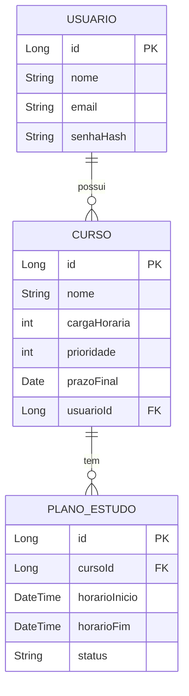

# Planejador de Horários

Sistema de gerenciamento de cursos e planejamento de horários de estudo desenvolvido com Spring Boot.

## 🚀 Tecnologias Utilizadas

- Java 21
- Spring Boot 3.1.5
- Spring Data JPA
- MySQL 8.0 (Produção)
- H2 Database (Testes)
- JUnit 5
- Mockito
- Maven

## 📋 Pré-requisitos

- Java 21
- MySQL 8.0
- Maven 3.8+
- Git

## 🔧 Configuração do Ambiente

### 1. Clone o Repositório
```bash
git clone [URL_DO_REPOSITORIO]
cd planejador_horario
```

### 2. Configure o Banco de Dados

#### Produção (MySQL)
```properties
# src/main/resources/application.properties
spring.datasource.url=jdbc:mysql://localhost:3306/tempomente
spring.datasource.username=seu_usuario
spring.datasource.password=sua_senha
```

#### Testes (H2)
```properties
# src/test/resources/application-test.properties
# Já configurado para usar H2 em memória
```

### 3. Execute os Testes
```bash
# Todos os testes
mvn test

# Apenas testes unitários
mvn test -Dtest=CursoControllerTest

# Apenas testes de integração
mvn test -Dtest=CursoControllerIntegrationTest
```

### 4. Execute a Aplicação
```bash
mvn spring-boot:run
```

## 🗂️ Estrutura do Projeto

```
src/
├── main/
│   ├── java/
│   │   └── br.com.leonardo.planejador_horario/
│   │       ├── adapter/
│   │       │   ├── inbound/
│   │       │   │   ├── controller/
│   │       │   │   └── dto/
│   │       │   └── outbound/
│   │       │       ├── entity/
│   │       │       ├── mapper/
│   │       │       └── persistence/
│   │       ├── application/
│   │       │   └── port/
│   │       ├── domain/
│   │       │   ├── exception/
│   │       │   ├── model/
│   │       │   └── validator/
│   │       └── usecase/
│   └── resources/
│       └── application.properties
└── test/
    ├── java/
    │   └── br.com.leonardo.planejador_horario/
    │       └── adapter/
    │           └── inbound/
    │               └── controller/
    └── resources/
        ├── application-test.properties
        └── schema.sql
```

## 📝 Documentação da API

### Swagger UI
- **URL**: http://localhost:8080/swagger-ui.html
- **Recursos**: Documentação interativa completa
- **Teste**: Endpoints testáveis via interface

### Endpoints Principais

#### Cursos
```http
POST /api/cursos
GET /api/cursos
GET /api/cursos/usuario/{usuarioId}
DELETE /api/cursos/{id}
```

## 🧪 Testes

O projeto possui uma cobertura abrangente de testes, incluindo:

### Testes Unitários
- Focados no comportamento isolado dos componentes
- Utilizam mocks para simular dependências
- Rápidos e não requerem infraestrutura

### Testes de Integração
- Validam o fluxo completo da aplicação
- Utilizam banco H2 em memória
- Testam a integração entre componentes

[Documentação Completa dos Testes](docs/testes.md)

## 📊 Modelo de Dados



## 🛠️ Próximos Passos

- [ ] Implementação do módulo de usuários
- [ ] Autenticação e autorização
- [ ] Geração automática de planos de estudo
- [ ] Interface web com React
- [ ] Notificações por email
- [ ] Relatórios de progresso

## 👥 Contribuição

1. Faça um fork do projeto
2. Crie uma branch para sua feature (`git checkout -b feature/AmazingFeature`)
3. Commit suas mudanças (`git commit -m 'Add some AmazingFeature'`)
4. Push para a branch (`git push origin feature/AmazingFeature`)
5. Abra um Pull Request

## 📄 Licença

Este projeto está sob a licença MIT. Veja o arquivo [LICENSE](LICENSE) para mais detalhes.