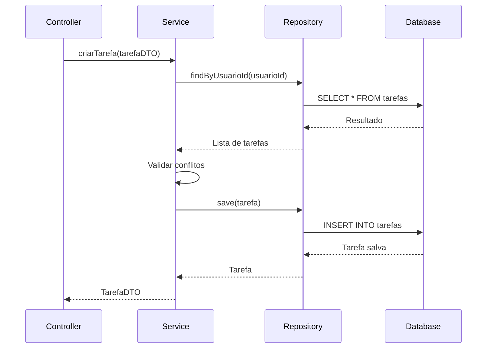
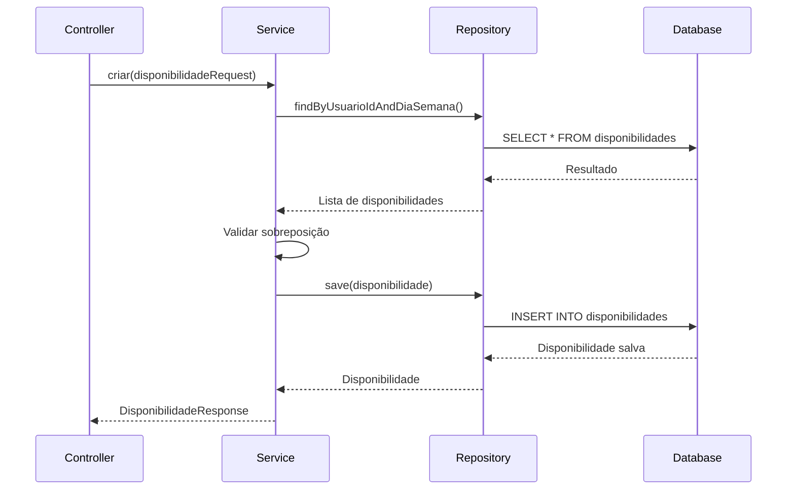

# Planejador de Horário

Sistema para gerenciamento de tarefas e disponibilidade de horários.

## Arquitetura

O projeto segue a arquitetura hexagonal (ports and adapters) com as seguintes camadas:

```
src/main/java/br/com/leonardo/planejador_horario/
├── adapter/
│   ├── inbound/           # Adaptadores de entrada (controllers, DTOs)
│   └── outbound/          # Adaptadores de saída (repositories, entidades)
├── domain/                # Regras de negócio e entidades
│   ├── entities/          # Entidades de domínio
│   ├── enums/            # Enums do domínio
│   ├── exception/        # Exceções do domínio
│   ├── repository/       # Interfaces dos repositórios
│   └── service/          # Serviços de domínio
└── config/               # Configurações da aplicação
```

### Diagrama de Sequência - Criação de Tarefa



### Diagrama de Sequência - Gerenciamento de Disponibilidade



## Decisões Técnicas

### 1. Arquitetura Hexagonal
- **Motivo**: Separação clara entre regras de negócio e infraestrutura
- **Benefícios**: 
  - Testabilidade
  - Manutenibilidade
  - Independência de frameworks

### 2. Spring Security com JWT
- **Motivo**: Autenticação segura e stateless
- **Implementação**: 
  - Token JWT com expiração
  - Refresh token
  - Validação de permissões

### 3. Validações de Domínio
- **Motivo**: Garantir integridade dos dados
- **Implementação**:
  - Validações em entidades
  - Exceções específicas
  - Mensagens claras

## Exemplos de Uso

### 1. Criar Tarefa

```http
POST /api/tarefas
Authorization: Bearer {token}
Content-Type: application/json

{
  "titulo": "Implementar API",
  "descricao": "Desenvolver endpoints REST",
  "status": "PENDENTE",
  "prioridade": "ALTA",
  "categoria": "DESENVOLVIMENTO",
  "dataInicio": "2024-03-20",
  "dataFim": "2024-03-25"
}
```

### 2. Listar Tarefas por Status

```http
GET /api/tarefas/status/PENDENTE
Authorization: Bearer {token}
```

### 3. Criar Disponibilidade

```http
POST /api/disponibilidade
Authorization: Bearer {token}
Content-Type: application/json

{
  "diaSemana": "SEGUNDA",
  "horaInicio": "09:00",
  "horaFim": "17:00"
}
```

### 4. Listar Disponibilidade por Dia

```http
GET /api/disponibilidade/usuario/{id}/dia/SEGUNDA
Authorization: Bearer {token}
```

## Regras de Negócio

### Tarefas
1. Não pode haver tarefas sobrepostas no mesmo horário
2. Tarefas atrasadas são marcadas automaticamente
3. Prioridades: BAIXA, MEDIA, ALTA
4. Status: PENDENTE, EM_ANDAMENTO, CONCLUIDA, CANCELADA

### Disponibilidade
1. Não pode haver horários sobrepostos no mesmo dia
2. Horário de início deve ser anterior ao de fim
3. Disponibilidade é por dia da semana
4. Múltiplos horários por dia são permitidos

## Testes

O projeto possui testes em diferentes níveis:

1. **Testes de Integração**
   - `TarefaIntegrationTest`
   - `DisponibilidadeIntegrationTest`

2. **Testes de Serviço**
   - `TarefaServiceTest`
   - `DisponibilidadeServiceTest`

3. **Testes de Repository**
   - `TarefaRepositoryTest`
   - `DisponibilidadeRepositoryTest`

Para executar os testes:
```bash
./mvnw test
```

Para verificar cobertura:
```bash
./mvnw test jacoco:report
```

## Configuração do Ambiente

1. Java 17
2. Maven
3. PostgreSQL
4. IDE recomendada: IntelliJ IDEA

### Variáveis de Ambiente
```properties
# Database
spring.datasource.url=jdbc:postgresql://localhost:5432/planejador
spring.datasource.username=postgres
spring.datasource.password=postgres

# JWT
jwt.secret=seu_secret_aqui
jwt.expiration=86400000
```

## Licença

Este projeto está sob a licença MIT. Veja o arquivo [LICENSE](LICENSE) para mais detalhes.