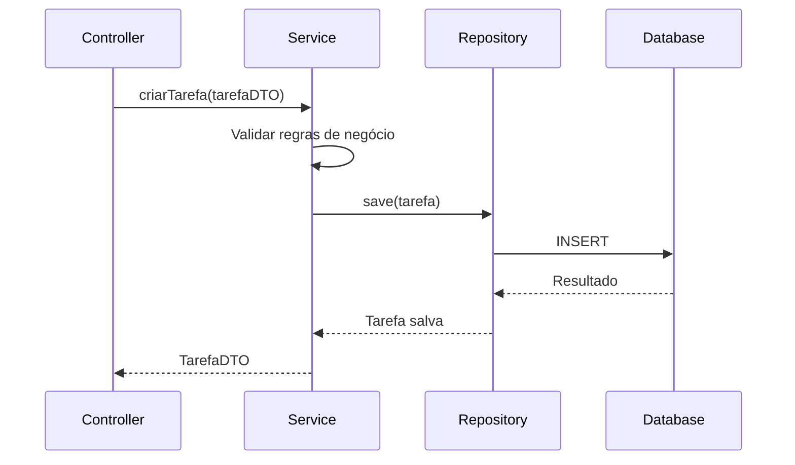
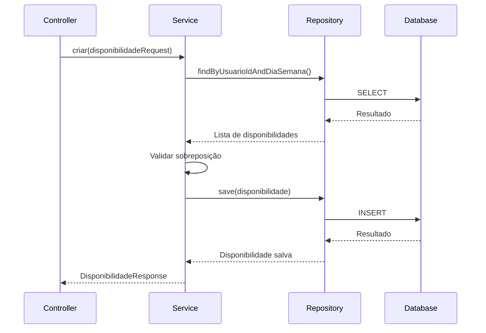

# Documentação de Arquitetura

## Visão Geral

O Planejador de Horário é um sistema desenvolvido seguindo a Arquitetura Hexagonal (Ports and Adapters), que visa separar as regras de negócio da infraestrutura técnica. Esta arquitetura permite que o domínio da aplicação seja independente de frameworks e tecnologias externas.

## Princípios Arquiteturais

1. **Separação de Responsabilidades**
   - Domínio isolado da infraestrutura
   - Adaptadores para entrada e saída
   - Serviços de domínio puros

2. **Inversão de Dependência**
   - Domínio não depende de frameworks
   - Interfaces definidas pelo domínio
   - Implementações adaptadas externamente

3. **Testabilidade**
   - Domínio testável isoladamente
   - Mocks facilitados pela arquitetura
   - Testes de integração claros

## Camadas da Aplicação

### 1. Domínio (Core)

```
domain/
├── entities/          # Entidades de domínio
├── enums/            # Enums do domínio
├── exception/        # Exceções de domínio
├── repository/       # Interfaces de repositório
└── service/          # Serviços de domínio
```

#### Entidades de Domínio

- **Tarefa**
  - Representa uma atividade a ser realizada
  - Contém regras de negócio para validação
  - Independente de persistência

- **Disponibilidade**
  - Representa horários disponíveis
  - Validações de sobreposição
  - Regras de negócio específicas

#### Serviços de Domínio

- **TarefaService**
  - Lógica de criação/atualização
  - Validações de negócio
  - Orquestração de operações

- **DisponibilidadeService**
  - Gerenciamento de horários
  - Validações de conflitos
  - Regras de disponibilidade

### 2. Adaptadores de Entrada (Inbound)

```
adapter/inbound/
├── controller/       # Controllers REST
├── dto/             # DTOs de request/response
└── exception/       # Handlers de exceção
```

#### Controllers

- **TarefaController**
  - Endpoints REST para tarefas
  - Validação de entrada
  - Transformação DTO/Entidade

- **DisponibilidadeController**
  - Endpoints REST para disponibilidade
  - Validação de horários
  - Transformação de dados

### 3. Adaptadores de Saída (Outbound)

```
adapter/outbound/
├── entity/          # Entidades JPA
├── mapper/          # Mapeadores
└── repository/      # Implementações JPA
```

#### Repositories

- **TarefaRepository**
  - Persistência de tarefas
  - Queries otimizadas
  - Paginação

- **DisponibilidadeRepository**
  - Persistência de disponibilidade
  - Queries por dia/horário
  - Validações de banco

## Fluxo de Dados

### 1. Criação de Tarefa



### 2. Gerenciamento de Disponibilidade



## Decisões Técnicas

### 1. Spring Boot

- **Motivo**: Framework maduro e robusto
- **Benefícios**:
  - Autoconfiguração
  - Grande ecossistema
  - Suporte ativo

### 2. JPA/Hibernate

- **Motivo**: Persistência objeto-relacional
- **Benefícios**:
  - Mapeamento objeto-relacional
  - Queries otimizadas
  - Cache de primeiro nível

### 3. JWT para Autenticação

- **Motivo**: Autenticação stateless
- **Benefícios**:
  - Escalabilidade
  - Performance
  - Segurança

## Padrões de Projeto Utilizados

1. **Repository Pattern**
   - Abstração de persistência
   - Queries encapsuladas
   - Testabilidade

2. **DTO Pattern**
   - Separação de representação
   - Controle de exposição
   - Validação de entrada

3. **Service Layer Pattern**
   - Lógica de negócio centralizada
   - Transações
   - Orquestração

## Considerações de Segurança

1. **Autenticação**
   - JWT com expiração
   - Refresh token
   - Validação de token

2. **Autorização**
   - Roles e permissões
   - Validação de acesso
   - Proteção de endpoints

3. **Validação**
   - Sanitização de entrada
   - Validação de domínio
   - Tratamento de exceções

## Monitoramento e Logging

1. **Logging**
   - Logs estruturados
   - Níveis de log
   - Rastreamento de requisições

2. **Métricas**
   - Tempo de resposta
   - Taxa de erro
   - Uso de recursos

## Próximos Passos

1. **Cache**
   - Implementar cache de segundo nível
   - Cache de consultas frequentes
   - Invalidação de cache

2. **Performance**
   - Otimização de queries
   - Índices adequados
   - Paginação eficiente

3. **Escalabilidade**
   - Cache distribuído
   - Balanceamento de carga
   - Replicação de banco 